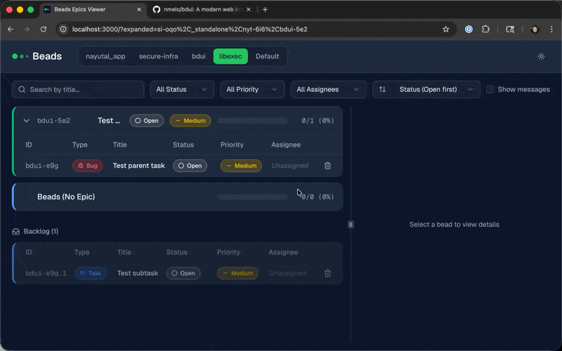

# Beads UI

A modern web interface for viewing and managing [beads](https://github.com/steveyegge/beads) issue tracking databases.



## Quick Start

**Homebrew:**
```bash
brew install nmelo/tap/beads-ui
beads-ui
```

**Docker:**
```bash
docker run -p 3000:3000 -v ~/.config/beads-ui:/root/.config/beads-ui ghcr.io/nmelo/beads-ui
```

Then open http://localhost:3000

## Features

### Core Functionality
- **Multi-Workspace Support** - Switch between multiple beads databases from different projects
- **Epic Tree View** - Hierarchical display with expandable epics and nested child epics
- **Real-time Auto-Update** - SSE connection watches for database file changes; UI auto-refreshes when you modify beads via CLI
- **Bead Detail Modal** - Full detail view with editable title, type, status, priority, and assignee

### Filtering & Sorting
- **Filter by Status** - Show open, in progress, or closed beads
- **Filter by Priority** - Show critical, high, medium, or low priority
- **Filter by Assignee** - Filter beads by assigned team member
- **Search** - Full-text search across bead titles
- **Sort Options** - Sort by title, priority, status, or last updated date (ascending/descending)

### Editing & Auto-save
- **Inline Status/Priority Changes** - Change status and priority directly from the list view
- **Auto-save** - All changes save automatically (debounced 500ms for text fields, immediate for dropdowns)
- **Optimistic Updates** - UI updates immediately while server syncs in background
- **Error Recovery** - Failed saves revert to previous state with toast notification

### Navigation & UX
- **URL-based State** - Expanded epics and selected bead persist in URL (shareable links)
- **Workspace Persistence** - Last selected workspace saved in cookie
- **Progress Bars** - Visual completion percentage for epics based on child bead status
- **Copyable IDs** - Click any bead ID to copy to clipboard
- **Breadcrumb Navigation** - Shows parent hierarchy in detail modal
- **Dark/Light Theme** - Toggle between themes

### Comments & Content
- **Comments** - View and add comments to beads
- **Markdown Rendering** - Descriptions, acceptance criteria, and comments render with markdown support
- **Expandable Comments** - Long comments truncate with "show more" toggle

## Tech Stack

- **Framework**: Next.js 16 (App Router)
- **UI Components**: Radix UI primitives with shadcn/ui styling
- **Styling**: Tailwind CSS v4
- **State Management**: React hooks with URL state via `useSearchParams`
- **Real-time Updates**: Server-Sent Events (SSE) with `fs.watch()`
- **Database**: Reads beads SQLite databases directly

## Getting Started

### Prerequisites

- Node.js 18+
- pnpm
- One or more beads databases (created via `bd init`)

### Installation

```bash
pnpm install
```

### Development

```bash
pnpm dev
```

Open http://localhost:3000 in your browser.

### Configuration

The UI automatically discovers beads databases in common locations:
- Current working directory (`.beads/*.db`)
- Paths configured in `~/.config/beads-ui/workspaces.json`

To add a workspace, create or edit `~/.config/beads-ui/workspaces.json`:

```json
{
  "workspaces": [
    { "id": "my-project", "name": "My Project", "databasePath": "/path/to/.beads/beads.db" }
  ]
}
```

## Architecture

```
app/
  api/events/       # SSE endpoint for real-time updates
  page.tsx          # Main epic viewer page
  layout.tsx        # Root layout with theme provider

actions/            # Server actions for database operations
  beads.ts          # CRUD operations for beads
  epics.ts          # Epic tree fetching
  workspaces.ts     # Workspace discovery

components/
  bead-detail-modal.tsx  # Full bead editor modal
  bead-table.tsx         # Bead list within epic
  epic-tree.tsx          # Recursive epic renderer
  filter-bar.tsx         # Search, filter, sort controls
  header.tsx             # Workspace selector, theme toggle

hooks/
  use-sse.ts        # SSE connection hook for auto-refresh

lib/
  db.ts             # SQLite database access
  types.ts          # TypeScript interfaces
```

## Contributing

See [CONTRIBUTING.md](CONTRIBUTING.md) for guidelines.

## License

Apache License 2.0
